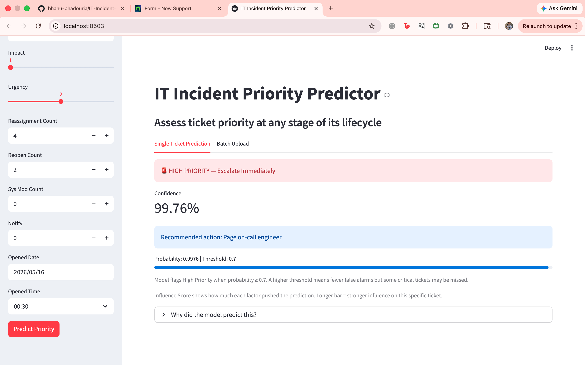
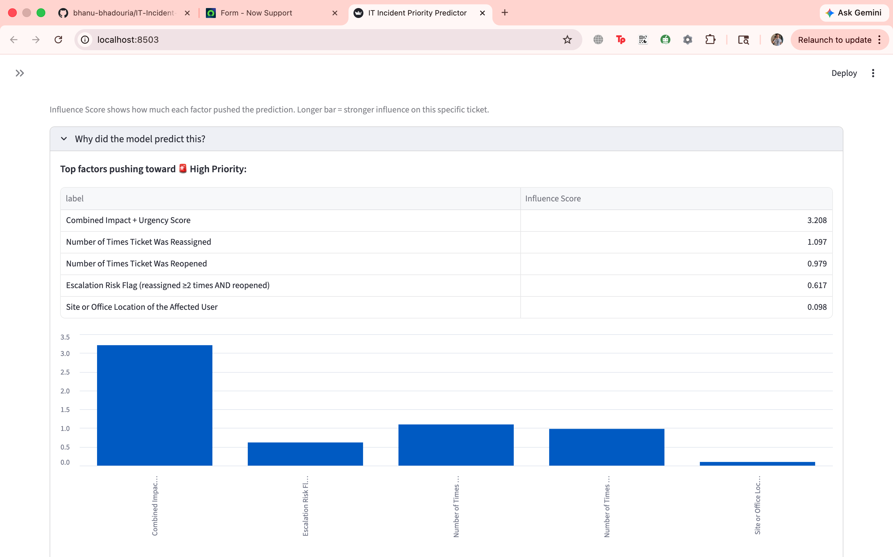
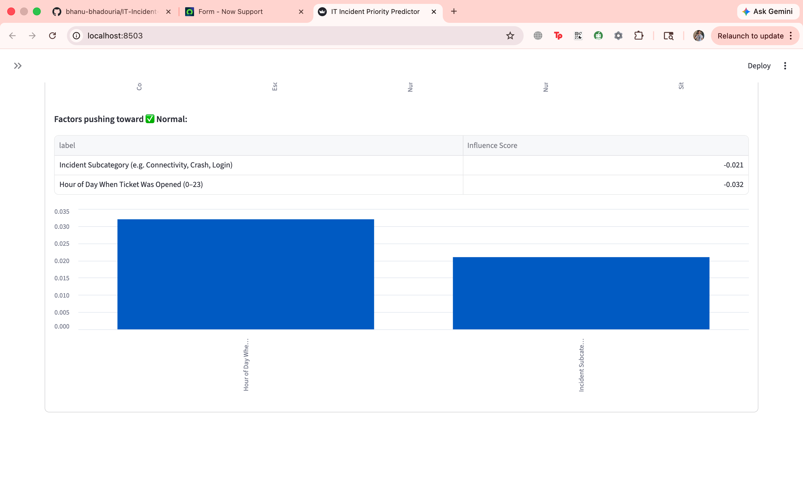
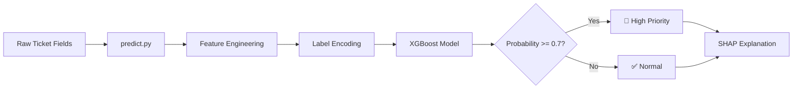

# IT Incident Priority Predictor

Predict and escalate high-priority IT tickets using machine learning on ServiceNow-style incident data.


**Live Demo:** [Coming Soon]

## The Problem

When a P1 incident hits — a network outage, a security breach, a crashed server — every minute without a response has a cost: SLA penalties, lost productivity, and engineers scrambling to triage a backlog manually. Today, L1 agents read incoming tickets and assign priority by hand, which is slow, inconsistent, and error-prone under pressure. This tool scores every ticket at the moment it's created, flags High Priority incidents automatically, and tells the engineer exactly which factors drove that decision — so the right tickets get escalated before the damage compounds.

## Demo

**Single Ticket Prediction — High Priority result with confidence score**


**SHAP Explanation — Top factors pushing toward High Priority**


**SHAP Explanation — Factors pushing toward Normal**


## Overview

This project analyzes IT incident data and builds an XGBoost model to automatically flag High Priority incidents at the point of creation — before an engineer has manually triaged them. It includes a full prediction pipeline, per-prediction SHAP explanations, and a batch CSV upload mode for bulk assessment. Designed to reduce manual triage time for L1/L2 support teams.

## Project Structure

```
IT-incident-priority-predictor/
├── README.md                          # This file
├── model_card.txt                     # Model documentation — intended use, metrics, limitations
├── requirements.txt                   # Python dependencies
├── .gitignore                         # Git ignore rules
│
├── data/
│   ├── raw/                          # Original datasets
│   │   └── incidents_day1.csv
│   └── processed/                    # Preprocessed data splits
│       ├── X_train.csv
│       ├── X_test.csv
│       ├── y_train.csv
│       └── y_test.csv
│
├── src/                              # Source code
│   ├── __init__.py
│   ├── eda.py                        # Exploratory Data Analysis
│   ├── feature_engineering.py        # Feature engineering & preprocessing
│   ├── model_training.py             # Decision Tree & Random Forest training
│   ├── xgboost_model.py              # XGBoost training & SHAP analysis
│   ├── predict.py                    # Prediction pipeline (feature engineering + inference)
│   ├── test_predict.py               # End-to-end pipeline validation (3 test cases)
│   └── app.py                        # Streamlit web app (single ticket + batch upload)
│
├── models/                           # Trained model artifacts
│   ├── best_model_day3.joblib        # Random Forest model
│   ├── best_model_final.joblib       # XGBoost model
│   ├── label_encoders.joblib         # Categorical encoders
│   ├── feature_list.joblib           # Feature names
│   └── threshold.joblib              # Decision threshold
│
├── outputs/
│   ├── plots/                        # Visualization outputs
│   │   ├── category_vs_priority.png
│   │   ├── confusion_matrix_dt.png
│   │   ├── confusion_matrix_rf.png
│   │   ├── confusion_matrix_xgb.png
│   │   ├── correlation_matrix.png
│   │   ├── feature_importance_rf.png
│   │   ├── numerical_distributions.png
│   │   ├── precision_recall_xgb.png
│   │   ├── roc_curve_comparison.png
│   │   ├── shap_summary.png
│   │   ├── shap_waterfall.png
│   │   ├── target_distribution.png
│   │   └── time_patterns.png
│   └── reports/                      # Analysis reports
│
├── notebooks/                        # Jupyter notebooks (optional)
└── venv/                             # Virtual environment
```

## Getting Started

### Prerequisites

- Python 3.11
- pip

### Installation

1. Clone the repository:
```bash
git clone <repository-url>
cd IT-incident-priority-predictor
```

2. Create a virtual environment:
```bash
python -m venv venv
source venv/bin/activate  # macOS/Linux
# or
venv\Scripts\activate  # Windows
```

3. Install dependencies:
```bash
pip install -r requirements.txt
```

## Usage

### Run the Streamlit App

```bash
streamlit run src/app.py
```

Opens a web app with two tabs:
- **Single Ticket Prediction** — fill in ticket fields, get a High Priority / Normal prediction with confidence score and SHAP explanation
- **Batch Upload** — upload a CSV of tickets, get predictions for all rows with a downloadable results file

Required CSV columns for batch mode: `impact`, `urgency`, `reassignment_count`, `reopen_count`, `contact_type`, `category`, `subcategory`, `opened_at`, `sys_mod_count`, `notify`

For batch predictions, use the sample file at `data/raw/sample_batch.csv`

---

### Run the pipeline in order (training):

### 1. Exploratory Data Analysis
```bash
python -m src.eda
```
Generates visualizations for understanding data patterns.

### 2. Feature Engineering & Preprocessing
```bash
python -m src.feature_engineering
```
Prepares data splits and creates encoded features.

### 3. Model Training (Baseline Models)
```bash
python -m src.model_training
```
Trains Decision Tree and Random Forest models with evaluation metrics.

### 4. Advanced Model (XGBoost with SHAP)
```bash
python -m src.xgboost_model
```
Trains XGBoost with early stopping and generates SHAP explanations.

## Data

- **Raw Data**: `data/raw/incidents_day1.csv` - Original incident records
- **Processed Data**: `data/processed/` - Train/test splits (generated by feature_engineering.py)

### Dataset Features

- **Categorical**: category, subcategory, contact_type, location, assignment_group
- **Numerical**: impact, urgency, reassignment_count, reopen_count, sys_mod_count
- **Temporal**: opened_at (hour, day_of_week, quarter)
- **Target**: is_high_priority (binary classification)

## Model Performance

| Model                        | Precision | Recall | F1   | AUC  |
|------------------------------|-----------|--------|------|------|
| Decision Tree                | 0.50      | 0.99   | 0.67 | 0.99 |
| Random Forest                | 0.39      | 1.00   | 0.56 | 0.99 |
| XGBoost (threshold=0.7) ✓   | 0.65      | 0.93   | 0.76 | 0.99 |

Threshold 0.7 was chosen to favour recall over the default: catching 93% of real P1s while cutting false alarms, so on-call engineers aren't paged for tickets that turn out to be routine.

## Architecture



## Key Insights

- Strong temporal patterns in incident priorities (business hours vs. after-hours)
- Impact and urgency are primary drivers of priority classification
- Escalation risk (reassignments + reopens) is a strong signal
- Class imbalance (≈9.7% high priority) requires careful threshold tuning

## Files

| File | Purpose |
|------|---------|
| `src/eda.py` | Data exploration and visualization |
| `src/feature_engineering.py` | Feature creation, encoding, and train/test split |
| `src/model_training.py` | Baseline model training and comparison |
| `src/xgboost_model.py` | Advanced model with SHAP analysis |
| `src/predict.py` | Prediction pipeline — feature engineering, encoding, inference |
| `src/test_predict.py` | End-to-end validation: High Priority, Normal, and ambiguous cases |
| `src/app.py` | Streamlit app — single ticket prediction + batch CSV upload |
| `models/best_model_final.joblib` | Trained XGBoost model for predictions |
| `model_card.txt` | Model documentation — metrics, limitations, intended use |

## Dependencies

See `requirements.txt` for full list. Key packages:
- pandas
- scikit-learn
- xgboost
- matplotlib & seaborn
- shap
- joblib
- streamlit

## License

This project is part of the IT incident management system.

## Contact

For questions or contributions, please reach out to the development team.
